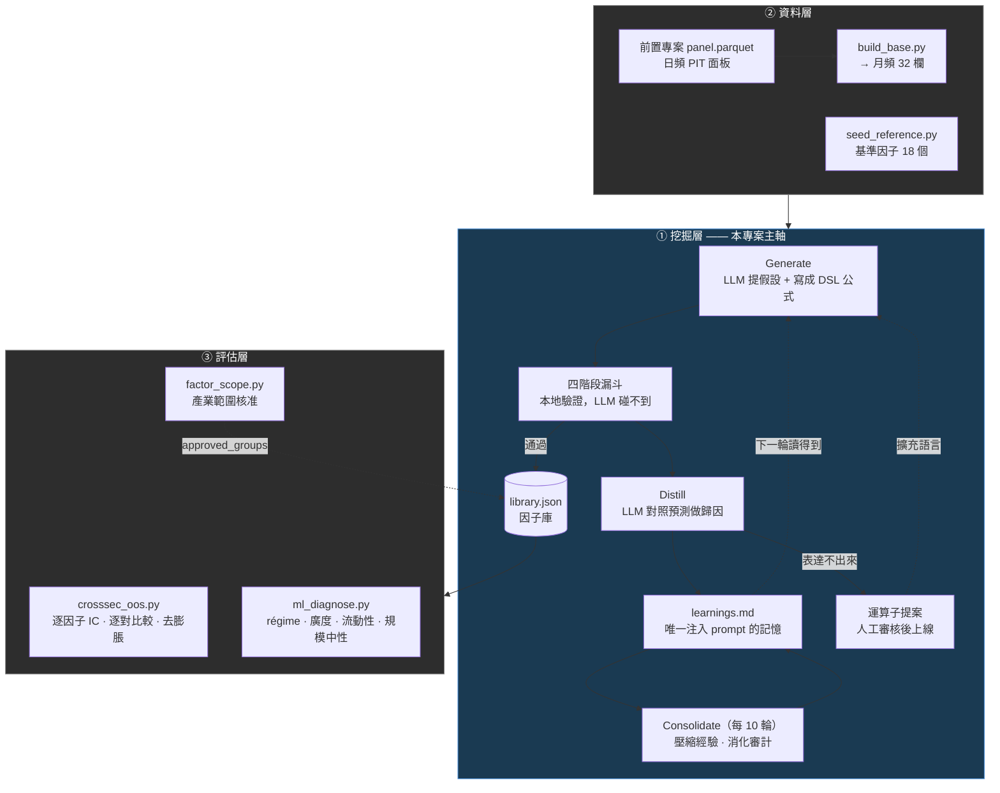
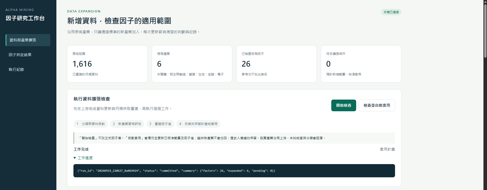
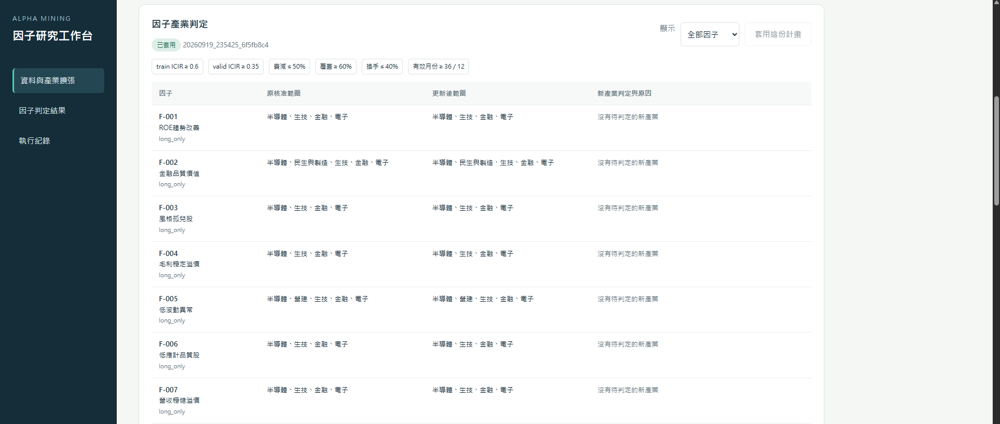
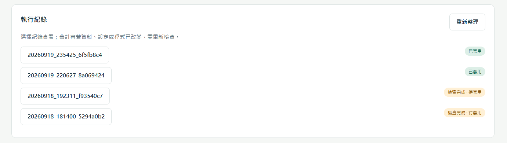

# 台股 Alpha 因子挖掘 Agent

**讓 LLM 提出有機制的假設，由本地程式嚴格驗證，再把成敗蒸餾成下一輪用得上的經驗。**

跑了 68 輪、1,043 個候選，26 個因子通過四階段漏斗入庫。

這個專案要回答的問題只有一個：**LLM 挖出來的因子，是真的抓到東西，還是搜尋一千次挑到的幸運兒？**
所以全篇的重心在**因子本身的有效性與檢定方法**，不在策略賺多少——
目前刻意不做投資組合評估（理由見「為什麼不報組合績效」）。

| | |
|---|---|
| 資料 | 1,616 檔台股、6 個產業、2012-01 ~ 2026-06（174 個月） |
| 因子庫 | 26 個自有（`F-xxx`）+ 18 個基準（`R-xxx`，方向修正後的原始欄位） |
| 入庫率 | 26 / 1,043 = **2.5%** |
| 多重檢定校正 | 以完整搜尋歷史（1,011 個候選）為試驗池，**24 / 26** 超過純運氣門檻 |
| 橫斷面樣本外 | 在挖礦時從沒看過的 2 個產業上，**24 / 26** 維持同向且 \|t\| ≥ 2 |
| 測試 | **227 passed**——由 AI 依規格書撰寫的功能性測試，其中四套針對前瞻偏差 |

- 設計理由 → `SPEC_架構設計規格書.md`
- 操作、參數、疑難排解 → `GUIDE_使用教學.md`
- 每個檔案在做什麼 → `FILES_檔案對照表.md`
- 資料擴張與產業範圍 → `SCOPE_資料擴張操作說明.md`

---

## 一、系統結構

四層，資料單向流動。**挖掘層是主軸，其餘三層存在的理由是讓它的產出可信、可用。**



### 1.1 受限 DSL —— 讓前瞻偏差「表達不出來」

因子公式不是自由的 Python，是一個**帶型別系統**的受限語言。用 `ast` 解析，**絕不 `eval`**。

```python
_SIGNATURES = {
    "ts_mean":     ("nw", "n"),    # 吃 (數值, 窗口) → 回數值
    "ts_corr":     ("nnw", "n"),   # 吃 (數值, 數值, 窗口) → 回數值
    "streak_true": ("bw",  "n"),   # 吃 (布林, 窗口) → 回數值
    "greater":     ("nn",  "b"),   # 吃 (數值, 數值) → 回布林
    "if_else":     ("bnn", "n"),   # 吃 (布林, 數值, 數值) → 回數值
}
```

33 個運算子、32 個白名單欄位（價量 10、品質 6、成長 5、價值 4、籌碼 7）。
窗口只准 `{3, 6, 12, 24}`、AST 深度 ≤ 3、一條公式最多 3 個欄位、禁巢狀 `if_else`、禁魔術常數。

**前瞻偏差是在語言層面寫不出來，不是事後檢查。** 窗口白名單擋的則是另一件事——
不是前瞻（窗口本來就向後看），是**窗口挑選的過擬合**：能試 4 個值跟能試 24 個值，搜尋空間差 6 倍。

新增運算子時**必須**在 `tests/test_dsl_no_lookahead.py` 的 `FORMULAS` 加一條用到它的公式，
否則 `test_all_operators_covered` 直接失敗。

### 1.2 四階段漏斗

| 關卡 | 判準 |
|---|---|
| 語法／解析 | DSL 合法性、欄位白名單、複雜度上限 |
| **Stage 1** IC | `\|IC\|` ≥ 0.02，方向與宣告一致 |
| **Stage 2** 與因子庫去相關 | ρ ≤ 0.5（含 18 個基準因子） |
| **Stage 3** 批次內去相關 | 同一輪候選彼此 ρ ≤ 0.7 |
| **Stage 4** 品質 | sub_train ICIR ≥ 0.45、validation ICIR ≥ 0.30、衰減 ≤ 50%、覆蓋 ≥ 0.60、月換手 ≤ 0.40 |
| **Stage 4b** 產業通道 | 整體未達標時檢查單一產業，門檻**更嚴**：ICIR ≥ 0.60 / 0.35 |

**產業通道的門檻比全池還嚴，這是反直覺但正確的**：單產業樣本少，而且有 6 個產業可以試，
等於多做 6 次檢定，門檻不提高就是在買樂透。這是一個做對了的多重檢定修正。

### 1.3 兩層記憶

| 層 | 內容 | 進 prompt 嗎 |
|---|---|---|
| `attempts/` | **1,043 筆**完整軌跡：假設、公式、事前預測、實測、診斷、教訓 | ❌ 只進不出，供人查閱與審計 |
| `learnings.md` | 90 行蒸餾經驗 | ✅ **唯一**注入 Generate prompt 的記憶 |

分開的理由是 prompt 預算與訊號雜訊比：1,043 筆塞不進 prompt，塞得進也只會稀釋。
**整理回合每 10 輪負責壓縮**——升級／推翻／合併既有 lesson，原文自動備份。

`learnings.md` 可以直接手動編輯。這是刻意的：蒸餾品質差時人可以立刻改，不必等下一輪。

**而 `attempts/` 只進不出這件事，後面會變成一個關鍵資產**——它讓完整的多重檢定校正成為可能。

### 1.4 agent 可以擴充自己的語言

表達不出某個想法時，agent 可以提案新運算子。機械驗證只查名稱格式／純函數簽名／
證據引用 ≥ 2，**不保證語意可用**（例如 `qtr_only` 通過了驗證，但在月頻面板上會產生 100% NaN），
所以**人工批准前絕不自動實作**。

目前 **5 個上線、2 個否決**。而且每個核准的運算子都在型別表旁留著它的證據編號：

```python
# 人工核准的提案（2026-08-27）：
#   streak_true 證據 A-0913/A-0915/A-0918（模型三次用 streak(布林,n) 撞型別錯）
#   clip_std    證據 A-0522/A-0823/A-0902
```

自我進化的稽核軌跡不是寫在文件裡，是寫在型別定義旁邊——改程式的人一定會看到。
另有 **52 筆** DSL 表達限制被記錄下來，是提案的證據來源。

### 1.5 產業範圍：對資料擴張的預設

因子不是在每個產業都有效。`library.json` 記錄三個欄位讓範圍管理機械化：

```
groups_at_admission     入庫當下面板上有哪些產業
approved_groups         現行使用範圍
excluded_at_admission   當初被排除的產業 —— 永不補回
```

於是「哪些算新產業」是機械判斷：`新產業 = 現在的產業 − groups_at_admission`。
資料擴張時 `factor_scope.py` 只對新產業重測，**舊的被排除產業永不補回**。

這條規則不是保守，是**避免用選擇過的資料重新選擇**：舊產業當初就是拿來挑因子的，
現在拿同一批資料重新判定「其實也通過」，跟貪婪選擇的偏誤是同一件事。新產業乾淨，
是因為挖礦時它們根本不存在。

#### 操作介面

判定會改寫 `library.json` 與 `factor_values.parquet`，所以它有一個本機介面，
讓「檢查」與「套用」分成兩個明確的動作，而不是一條會直接改庫的指令。

```bash
python -B src/scope_ui.py --port 8765     # → http://127.0.0.1:8765
```



介面本身沒有任何判定邏輯，四個動作全部轉呼叫 `factor_scope.py` 的 CLI：

| 介面動作 | 實際執行 | 會不會改正式因子庫 |
|---|---|---|
| 開始檢查 | `factor_scope.py --check-only` | 否，只產生計畫 |
| 檢查並自動套用 | `factor_scope.py --auto-apply` | 會（先備份） |
| 套用這份計畫 | `factor_scope.py --apply RUN_ID` | 會 |
| （僅 CLI）中斷回復 | `factor_scope.py --recover` | 還原未完成的提交 |

上方四張卡是當前面板狀態：**面板股票 1,616、現有產業 6、已檢查自有因子 26、
符合擴張條件 0**（最後一項是「等著被套用的擴張數」，已套用完就歸零）。
下方四個步驟是流程本身：分類與資料核對 → 新產業資格評估 → 重建因子值 → 依模式保留計畫或套用。

**使用順序是固定的**：先在上游完成資料更新、再跑 `build_base.py` 重建月頻面板，
然後才按「開始檢查」。介面不會替你重建資料。



判定表上方那排就是 `config.yaml` 的 `stage4b_industry` 門檻，直接顯示在畫面上而不是
埋在設定檔裡：**train ICIR ≥ 0.6、valid ICIR ≥ 0.35、衰減 ≤ 50%、覆蓋 ≥ 60%、
換手 ≤ 40%、有效月份 ≥ 36 / 12**。比全池門檻（0.45）嚴，因為單產業樣本少、
又是跨產業多重比較。

每一列是一個因子的「原核准範圍 → 更新後範圍」，右欄寫出每個新產業的判定與原因。
多數因子顯示「沒有待判定的新產業」——那代表 `groups_seen` 已經涵蓋所有現行產業，
不會被重測第二次。右上的下拉可切「全部因子／範圍擴張／維持原範圍」。



每次檢查都有 `run_id`（時間戳 + 隨機碼），狀態分「檢查完成 · 待套用」與「已套用」。
計畫綁定輸入雜湊：**資料、設定或程式只要動過，舊計畫就被標成過期，不准套用**，
必須重新檢查。套用時會先備份 `library.before` / `values.before`，中途失敗自動回滾。

> 服務只綁 `127.0.0.1` 並驗 `Host` 標頭，POST 要帶隨機 CSRF token 與相符的 Origin，
> 動作是白名單四選一、`run_id` 走正則驗證，一次只准跑一個子工作。純標準庫 `http.server`，
> 沒有額外 web 框架依賴。**不要把這個服務對外開放。**

#### 這個機制實際跑過一次

資料修復後面板從 958 檔 / 4 產業擴到 **1,616 檔 / 6 產業**（新增民生與製造、營建），
分類衝突 0 筆。第一次檢查（`20260919_220627_8a069424`）26 個因子裡 **6 個通過新產業門檻**：

| 因子 | 新增產業 | train ICIR | valid ICIR |
|---|---|---:|---:|
| F-002 金融品質價值 | 民生與製造 | 0.679 | 0.750 |
| F-005 低波動異常 | 營建 | 0.760 | 1.086 |
| F-014 本業成長價值股 | 民生與製造 | 0.721 | 0.559 |
| F-016 本業獲利創高股 | 民生與製造 | 0.618 | 0.668 |
| F-024 成長無空頭疑慮 | 民生與製造 | 0.759 | 0.618 |
| ~~F-026 金控效率重估~~ | ~~營建~~ | ~~0.601~~ | ~~0.544~~ |

每一列都是**該產業內**單獨計算的，不是六產業合起來的 ICIR——表上 F-005 的 0.760
就是營建這一個產業內的 train ICIR。

F-026 那一列後來被**撤銷**，原因不是產業變多，是底層資料被修好了。資料修復的
migration（`20260919_234830_priority_repairs`）改動了 `bp`（44,336 格）、`turn_21`
（238,266 格）等欄位，而 F-026 的公式 `mul(cs_rank(bp), cs_rank(delta(op_margin,12)))`
正好吃到 `bp`：重算後營建的 train ICIR 由 0.601 掉到 0.557，低於 0.60 門檻。
同一次重算裡另外 5 個仍然通過。撤銷理由連同完整指標寫進該因子的
`data_correction_history`，不是靜默移除。最終 5 個因子擴張，其餘維持原範圍。

這些判定全部只用 sub_train + validation，test 沒有參與。

---

## 二、漏斗與自我進化的證據

### 2.1 1,043 個候選，26 個入庫

兩種讀法回答不同問題：

| 關卡 | 佔總數 | **條件淘汰率**（走到這關的因子死掉的比例） |
|---|---|---|
| 語法／解析 | 0.7% | 0.7% |
| **Stage 1** IC | 47.4% | 47.8%（1011 → 528） |
| **Stage 2** 與因子庫去相關 | 28.3% | **54.7%**（528 → 239） |
| Stage 3 批次內去重 | 0.5% | 2.1%（239 → 234） |
| **Stage 4** 品質 | 20.4% | **88.9%**（234 → 26） |
| **入庫** | **2.5%** | 18 個一般 + 8 個產業專屬 |

S3 只殺 0.5% 是正常的——S1／S2 已經先刷掉大部分，同一輪內互相重複的候選通常在
對上因子庫時就先死了。條件讀法下 **S4 才是最狠的一關**，走到此處的因子 89% 被刷掉。

失因分類（Distill 回合由 agent **自評**，不是程式判定）：`hypothesis_wrong` 396 筆、
`expression_bad` 300 筆、`duplicate` 269 筆、通過 25 筆、早期未標記 53 筆。

這個欄位有實際用途：`unblock.py` 只承認失因為 `expression_bad` 的 attempt 當作運算子提案的
證據——機制被證偽或與既有因子重複，都不是 DSL 表達力不足造成的，不該拿來要求擴充語言。

### 2.2 入庫率一路下滑，但下滑的原因才是重點

```bash
python -B src/mining_stats.py
```

| 區段 | 候選 | 語法 | **S1 IC** | **S2 去相關** | S3 | **S4 品質** | 入庫 |
|---|---|---|---|---|---|---|---|
| 前 1/3（輪 1-22） | 330 | 0.0% | **53.9%** | **12.1%** | 1.2% | **28.5%** | **4.2%** |
| 中 1/3（輪 23-45） | 345 | 0.3% | 43.5% | 35.7% | 0.3% | 17.1% | 2.6% |
| 後 1/3（輪 46-68） | 345 | 1.7% | **44.9%** | **36.5%** | 0.0% | **15.9%** | **0.9%** |
| | | | **−9.0pp** | **+24.4pp** | | **−12.5pp** | |

單看入庫率 4.2% → 0.9%，像是 agent 越挖越差。拆開各關卡的淘汰組成，結論相反：

**S1（訊號強度）與 S4（品質）的淘汰率雙雙下降——agent 提的假設變好了。
唯一上升的是 S2（跟既有因子重複），而且是三倍。**

> **瓶頸從「找得到訊號嗎」變成「找得到新的訊號嗎」。**
> 每個新候選都得同時跟既有因子的相關度低於 0.5，這個門檻本來就會越來越難。
> 入庫率下滑是結構性的遞減，不是迴圈失效。

這個說法有可以推翻它的條件：**如果 agent 真的在退步，S1 或 S4 的淘汰率應該上升。**
實測兩者都在下降。`mining_stats.py` 會直接印出判讀，走向不符時會說「假設品質下降」
而不是「飽和」——結論不是寫死在文件裡的。

唯一反向的指標是語法錯誤 0.0% → 1.7%：簡單的公式寫完了，agent 開始嘗試更複雜的結構，偶爾寫壞。

### 2.3 成本

68 輪累計。最近一週 4 輪、504,717 tokens、**$3.24**（約 **$0.81／輪**），
其中 **51% 是輸出 token**——成本主要花在推理，不是讀資料。
這也是成本槓桿所在：降低 `config.yaml` 的 `candidates_per_round`（每輪要 LLM 提幾個候選，
目前 15）比縮減 prompt 有效得多——prompt 在輸入端，候選數驅動的是輸出端。

---

## 三、因子評估：逐因子對上基準因子

### 3.1 為什麼不報組合績效

回測是**逐月在各產業內**取前 10%，等於每個產業各自等權。但自有因子裡有不少是
產業限定的（`approved_groups` 只有 1~2 個產業），把它們和全池因子合成同一個分數，
等於讓一個只在電子有效的因子去替營建的股票打分。

**合成績效因此混雜了兩件事：「因子有沒有用」與「產業配置對不對」。**
而這個專案只想回答第一件。

逐因子評估沒有這個問題——**每個因子只在自己的核准產業內量 IC**。
附帶的好處是完全不經過回測引擎，於是與缺報酬處理、換手定義、成交成本都無關。

### 3.2 基準是什麼

18 個 `R-xxx` 不是別人的策略，是**原始欄位本身**：方向修正後（`value_orientation` ±1）、
只用 sub_train + validation 選取與去重的 32 個登錄基礎欄位。

所以這個比較問的是最赤裸的問題：**LLM 寫的公式，比得過它用的原始素材嗎？**

兩邊都只用 sub_train + validation 選出（基準因子的 `selection_periods` 明確記錄），
**test 期對兩邊同樣是樣本外，比較是對稱的。**

### 3.3 分布對照（test 期）

```bash
python -B src/crosssec_oos.py --vs-reference
```

| | n | test ICIR 中位 | 平均 | ICIR > 0.3 | \|t\| ≥ 2 | 中位覆蓋產業 |
|---|---|---|---|---|---|---|
| **自有（LLM 公式）** | 26 | **0.455** | **0.480** | **23/26（88%）** | **24/26（92%）** | 4 |
| 基準（原始欄位） | 18 | 0.402 | 0.379 | 12/18（67%） | 15/18（83%） | 6 |

前段班：F-021 保守增提金控 ICIR 0.75（t 6.62）、F-019 現金含金價值股 0.69、
F-026 金控效率重估 0.66、F-018 低波動隱藏成長股 0.66。
基準最強的是 R-031 現金殖利率 0.68、R-029 盈餘殖利率 0.66。

> ⚠️ **覆蓋數的差距要拆開看**：自有因子中位 4 個產業、基準 6 個，但這裡有兩個原因混在一起。
>
> 26 個自有因子裡有 **18 個入庫時並未排除任何產業**。它們的核准範圍之所以是 4，
> 是因為**挖礦當時面板上只有 4 個產業**（半導體／電子／生技／金融）——民生與製造、
> 營建是資料修復後才加進來的。這是世代差，不是挑過的結果。
>
> 真正被 `approved_groups` 限定的是 **8 個**：F-009、F-013、F-014、F-016、F-017、
> F-018、F-019、F-025，各自只核准 1～2 個產業。這 8 個確實只在自己有效的產業內被量，
> 而且前段班的 F-019（0.69）與 F-018（0.66）都在其中。**這一組與基準的比較條件不對等，
> 讀表時要把它們獨立出來看。**

### 3.4 逐對比較：優勢在穩定度，不在訊號強度

```bash
python -B src/crosssec_oos.py --pairwise   # → logs/pairwise_own_vs_reference.csv
```

每個自有因子 × 每個基準因子 × 該自有因子的每個核准產業，三個 span 共 **4,383 列 × 21 欄**。

| 指標（test 期，1,461 個配對） | 自有中位 | 基準中位 | 自有勝率 |
|---|---:|---:|---:|
| IC 均值 | 0.0403 | 0.0436 | 51.8% |
| **IC 標準差**（越小越穩） | **0.1159** | **0.1488** | **66.9%** |
| IC 全距 max−min（越小越穩） | 0.571 | 0.775 | 67.8% |
| **ICIR** | **0.358** | **0.286** | **63.6%** |

ICIR = IC 均值 ÷ IC 標準差，所以優勢來自哪一項可以直接拆開。取對數相減：

```
log(ICIR_自有 / ICIR_基準)  =  log(IC均值比)  −  log(IC標準差比)
        中位 +0.219        =    −0.0005      −     (−0.1805)
```

**訊號項貢獻 −0.0005（等於零），波動項貢獻 +0.1805（全部）。**
自有因子的 ICIR 優勢完全來自 IC 波動比基準低 16.5%，IC 均值沒有優勢。

也就是說：**LLM 挖出來的公式，相對於原始欄位，貢獻是「把同樣強度的訊號變得震盪較少」。**
這其實合理——那些公式大多在做正規化、去噪、取穩定度
（`neg(ts_std(...))`、`sdiv(x, ts_std(x))`、`cs_rank` 交叉相乘）。

典型樣本是 **F-009 營收加速趨勢**（對 18 個基準因子取中位）：IC 均值比基準**低** 0.014，
但全距小了 0.390、ICIR 高 0.262——訊號沒比較強，但穩定很多。

反過來，**26 個裡有 7 個的 ICIR 中位輸給基準**：F-006、F-007、F-008、F-011、F-013、
F-015、F-025。其中 F-008 低調接近新高是唯一「ICIR 較低、波動還更大」的（全距 +0.371）；
其餘 6 個的波動其實比基準小，輸在 IC 均值。沒有任何一個因子三項全輸。
這 7 個列出來比藏起來可信。

> 讀 CSV 時注意：`d_ic_range = own − ref`，**這一欄正值代表自有因子波動較大、也就是較差**，
> 方向與 `d_ic_mean`、`d_icir` 相反。上表的「勝率」已經換算成統一方向，不必再翻。
> CSV 另有 `median_stocks` 一欄——像金融只有 49 檔，單月 IC 的極值主要反映樣本雜訊，
> 讀全距一定要配著它看（標準差對此比全距穩健，所以上表以標準差為準）。

---

## 四、兩種樣本外

### 4.1 往旁邊走：從沒看過的產業

26 個自有因子是在 **4 個產業、958 檔**上挖出來的。資料修復後面板擴為 1,616 檔，
其中**民生與製造（309 檔）與營建（89 檔）是兩個完整的新產業——agent 一次都沒看過**。

這構成與時間序列互相獨立的第二種樣本外：

```
時間序列樣本外：往前走（test 期 2020-01 起）
橫斷面樣本外：  往旁邊走（新產業）
```

```bash
python -B src/crosssec_oos.py            # 新產業 × 全期
python -B src/crosssec_oos.py --span test # 兩個維度同時樣本外
```

| 檢定 | 通過（同向且 \|t\| ≥ 2） |
|---|---|
| 新產業 × 全期 | **24 / 26** |
| 新產業 × test 期（最嚴格） | **19 / 26** |

test 期新產業最強的：F-018 t 5.86、F-010 t 5.09、F-002 t 4.69、F-024 t 4.68。

**真正「在原產業很強、到新產業失效」的只有 3 個**——其餘沒過的是在兩邊都弱
（test 期本來就不顯著），不是跨產業失敗：

| 因子 | 原 4 產業 t | 新 2 產業 t |
|---|---|---|
| F-012 淨化ROE動能 | 5.29 | **0.25** |
| F-006 低應計品質股 | 3.87 | **0.44** |
| F-009 營收加速趨勢 | 3.56 | 1.76 |

### 4.2 往前走：test 期不需要校正

選取只用了 sub_train + validation，**test 從未參與挑選**——沒有選擇偏誤就不需要校正。

> ⚠️ 但 test 期已被歷次研究反覆檢視，**不是全新 holdout**。
>
> 這個專案跑了 68 輪。每一輪之後都有人看過 test 期的數字，然後決定下一步往哪挖、
> 門檻要不要調、`learnings.md` 留哪幾條。**那些決定把 test 期的資訊帶回了設計裡**，
> 只是沒有留在任何一條程式或任何一個指標上。這叫研究者自由度
> （researcher degrees of freedom）。
>
> 為什麼統計校正修不了：去膨脹公式需要試驗數 N，而 `attempts/` 之所以能給出 1,043，
> 是因為每次候選提交都留了紀錄。但「看了一眼 test 期數字然後改了主意」**沒有計數器**，
> N 是未知的，未知的 N 代不進公式。`ORIENT_CUTOFF` 與 `test_metrics_sealed` 是在
> 壓低洩漏速度，不是消除它。**唯一乾淨的檢驗是時間往前走**：往後新產生的資料，
> 是這 68 輪裡沒有任何人看過的。

---

## 五、多重檢定校正：這些因子會不會只是運氣？

1,043 次嘗試留下 26 個。那 26 個的 ICIR 就是**從千次搜尋裡挑出的極大值**——
選擇偏誤一分不少，而且沒有組合來平均雜訊，單因子的偏誤更赤裸。

```bash
python -B src/crosssec_oos.py --deflate-icir
```

### 5.1 直接對 IC 序列去膨脹，不經過回測

**ICIR 在數學形式上就是 Sharpe**：

```
Sharpe = mean(月報酬) / std(月報酬)
ICIR   = mean(月 IC)  / std(月 IC)      ← 同一個估計量
```

Bailey & López de Prado 的去膨脹公式吃的是「一條序列 + N 個試驗」，
不在乎那條序列是報酬還是 IC。所以直接對 IC 序列做，完全不碰回測引擎。

### 5.2 試驗池是真正的搜尋歷史

**1,011 個候選，含 985 個被漏斗刷掉的。**

多數研究做不到這件事——他們不留被拒紀錄，試驗數只能用存活數，嚴重低估搜尋量。
本專案的 `attempts/` 只進不出，連死在 Stage 1 的都留著指標。

### 5.3 虛無分布是最容易算錯的地方

門檻 =「N 次試驗中最大值的期望」= σ × f(N)，關鍵在 σ 取什麼：

| 虛無分布 | σ | 門檻（N = 1011） | 通過 |
|---|---|---|---|
| (A) 候選 ICIR 的**經驗**標準差 | 0.2867 | 0.934 | 3 / 26 |
| **(B) 無技巧的理論值 1/√T** | **0.1313** | **0.428** | **24 / 26** |

**(A) 是錯的。** 經驗標準差是理論值的 2.4 倍，那個差距是**候選之間真實的強弱差別**，
不是抽樣雜訊。拿它當虛無等於假設「所有候選都沒訊號、觀察到的離散全是運氣」。

正確的虛無是 (B)：一個沒有預測力的因子，月 IC 均值為 0、ICIR 的抽樣誤差就是 `1/√T`。

**結果：24 / 26 個因子的 sub_train ICIR 超過純運氣門檻 0.428。**
沒過的是 F-021（0.414）與 F-008（0.398）。

> 而且 1,011 個候選彼此高度相關（Stage 2 存在的理由就是殺重複），獨立性假設不成立
> → 有效試驗數小於 1,011 → **真實門檻比 0.428 更低**，所以這已經站在偏保守的一側。

F-021 值得單獨記一筆：它在 sub_train 幾乎墊底（0.414，沒過門檻），卻是 test 期最強的
（ICIR 0.75、t 6.62）。**它不是因為訓練期好看才被選上的**——選擇偏誤的典型長相是
「訓練期極高、測試期崩掉」，它剛好相反。

---

## 六、方法論：怎麼確保這些數字不是自己騙自己

### 6.1 四層前瞻偏差防護

> **先說清楚測試是怎麼來的**：226 個測試是 AI 依規格書撰寫的功能性測試，全數通過。
> 這代表「規格有被編碼成可執行的斷言」，不代表有人逐條人工審閱過 226 個案例。
> 下面四套是其中另外做過變異驗證的部分。

| 層 | 檔案 | 檢查什麼 |
|---|---|---|
| DSL 語言層 | `test_dsl_no_lookahead.py` | 33 個運算子逐一驗證 |
| 全管線 | `test_pipeline_no_lookahead.py` | 資料 → 漏斗 → 診斷 |
| 診斷方向 | `test_ml_diagnose.py` | 單因子方向只能用選取窗決定 |
| 組合實驗室 | `test_factor_lab.py` | walk-forward + embargo、橫斷面標準化 |

共同手法：**汙染 cut 之後的資料，斷言 cut 之前的輸出位元級相同**（`check_exact=True`，不給容差）。

> ⚠️ 最後一列蓋的是 `factor_lab.py` 的合成模型（ridge／lgbm），而 walk-forward
> **目前不用於本文的任何結論**——本文的數字全部來自 `crosssec_oos.py` 的逐因子 IC，
> 那條路徑不經過合成模型也不經過回測引擎（`crosssec_oos.py` 根本沒有 import
> `factor_lab`）。walk-forward 保護的是合成模型的參數，而這個專案現在不做組合評估。
> 它留在測試裡是因為程式還在，不是因為結論依賴它。

**光有測試不夠——測試本身也可能是假的。** 這四套都做過變異驗證，故意把程式寫錯、
確認測試會轉紅：

```
把 walk_forward 的訓練窗改成全期     → test_walk_forward_no_lookahead  轉紅
把 embargo 拿掉                     → test_segments_embargo_gap        轉紅
```

專案初期就抓到 `test_pipeline_no_lookahead` 的汙染點寫死了 index、落在 `sub_train` 內部
——**測試自己在製造假陽性**，整套前瞻檢測形同虛設。

### 6.2 一個真實的案例：方向不能用全期決定

`ml_diagnose._active_returns()` 原本對整段資料算 mean IC 決定因子方向，**定完向才切 test**。
一個在 train 為負、在 test 強正的因子會被事後翻向，然後在 test 上量出漂亮的數字——
那個數字是自己造出來的。

```python
ORIENT_CUTOFF = fl.SPANS["validation"][1]       # 2019-12
ic = _mean_ic(sub[sub["ym"] <= ORIENT_CUTOFF])  # 不再吃全期
```

驗收方式是造一個對抗案例：train 期微弱為負、test 期強正。
**選取窗 IC −0.97、全期被 test 拉成 +0.37**——舊實作在這裡不會翻向。

### 6.3 密封的測試期

`library.json` 每個因子都有 `test_metrics_sealed`，**絕不進入任何 prompt**。
agent 只能看到 sub_train 與 validation。因子的產業核准、方向鎖定，也全部只用 ≤ validation 末端。

`report.py` 的人類報表含密封指標，**檔頭明寫嚴禁複製進 prompt 或 learnings.md**。

### 6.4 27 個審查編號

外部程式碼與數值正確性評估提出 27 個問題（`REVIEW_程式碼與數值正確性評估報告_2026-09-14.md`），
**全數結案**：21 項修掉、4 項因相關程式已封存而不需處理、2 項（R05 缺報酬篩選、
R12 換手定義）因現階段不做組合評估而不適用。逐項理由見 `TODO.md`。

R05 的防護仍然留著——回測不再默默跳過缺報酬的股票，改成直接丟 `MissingReturnError`，
所以不會有人不小心引用到被汙染的績效數字。

---

## 七、安裝與使用

```bash
pip install pandas numpy pyarrow pyyaml pytest      # 必要
pip install lightgbm scipy shap                     # 選配：合成、去膨脹、SHAP
```

需要 Claude Code CLI（`claude` 指令可用）與前置專案資料
`../tw_alpha_strategy/data/processed/panel.parquet`。

> 長時間無人值守跑的話，建議改用一年期 token 而非互動登入，避免 OAuth 過期：
> `claude setup-token` → `setx CLAUDE_CODE_OAUTH_TOKEN "<token>"`

### 首次設定

```bash
python -B src/build_base.py                 # panel → 月頻面板（1,616 檔 / 6 產業）
python -B src/build_regime.py               # 市場狀態表
python -B src/seed_memory.py                # 初始化空記憶（不預載任何理論）
python -B src/seed_reference.py --apply     # 匯入 18 個基準因子
python -m pytest tests/ -q                  # 227 passed（約 1.5 分鐘）
```

### 挖礦

```bash
python -B src/mining_loop.py --dry-run   # 先看 Generate prompt 長什麼樣
python -B src/mining_loop.py             # 跑 1 輪（約 8~15 分鐘、$0.8~1.5）
python -B src/mining_loop.py --rounds 5  # 連跑 5 輪（受週預算自動停）
python -B src/mining_loop.py --mock      # 假 LLM 跑通管線，不耗額度
python -B src/mining_loop.py --budget    # 只印本週用量
```

### 人工監督（放行自動化前必做）

```bash
python -B src/query_attempts.py --verdict passed   # 看入庫因子的假設品質
type memory\learnings.md                           # 審核蒸餾出的經驗
python -B src/consolidate.py                       # 手動觸發整理回合
python -B src/unblock.py --apply                   # 把卡住的假設放回佇列
```

審核重點：hypothesis 是否有機制（而非套套邏輯）、diagnosis 是否對照了 prediction、
lesson 是否過度泛化。**如果 lesson 品質差，先修 `prompts/` 再繼續**，不要讓垃圾經驗累積。

### 因子評估

```bash
python -B src/crosssec_oos.py --vs-reference    # 自有 vs 基準的分布對照
python -B src/crosssec_oos.py --pairwise        # 逐對 CSV（4,383 列）
python -B src/crosssec_oos.py --deflate-icir    # 多重檢定校正
python -B src/crosssec_oos.py --span test       # 橫斷面樣本外
python -B src/mining_stats.py                   # 漏斗組成與自我進化
python -B src/report.py --html                  # 因子庫總覽（含密封指標，人類專用）
```

### 資料擴張後的產業範圍重測

```bash
python -B src/build_base.py                     # 先重建面板
python -B src/scope_ui.py --port 8765           # 本機介面（僅 localhost）
python -B src/factor_scope.py --check-only      # 或走 CLI
python -B src/factor_scope.py --apply RUN_ID
```

只評估**尚未見過的新產業**，舊排除產業永不補回；沿用 Stage 4b 的 train／validation
標準，**不讀 test 表現來核准**。詳見 `SCOPE_資料擴張操作說明.md`。

---

## 八、目錄速覽

```
config.yaml / fields.yaml       全部門檻與欄位白名單（單一事實來源）
prompts/                        Generate / Distill / Consolidate 模板

── 挖掘層（主軸）──────────────────────────────
src/dsl.py                      受限 DSL：33 個運算子、型別系統、前瞻語言級封鎖
src/eval_candidates.py          四階段漏斗 + 產業通道
src/mining_loop.py              orchestrator（claude -p 編排、預算計量）
src/consolidate.py              整理回合（經驗壓縮 + 運算子提案）
src/memory.py                   兩層記憶（attempts + learnings）
src/admit.py / src/unblock.py   入庫 / 解鎖卡住的假設
src/mining_stats.py             漏斗組成與「飽和 vs 退步」的判讀（附可推翻的條件）

── 資料層 ────────────────────────────────────
src/build_base.py               panel → 月頻 32 欄面板
src/build_regime.py             市場狀態標註表
src/seed_reference.py           基準因子匯入（原始欄位，方向修正）

── 評估層 ────────────────────────────────────
src/crosssec_oos.py             逐因子 IC / 逐對比較 / 去膨脹 / 橫斷面樣本外
src/factor_scope.py             產業範圍核准（版本化、可回復）
src/scope_ui.py + .html         本機介面（僅 localhost，固定指令）
src/ml_diagnose.py              régime / 廣度 / 流動性 / 規模中性
src/compare_upstream.py         與前置專案 DFS 的相容對照
src/backtest.py / factor_lab.py 回測核心與組合實驗室（目前不用於結論）
src/audit.py / src/report.py    聚合審計（只輸出維度聚合）/ 人類報表

memory/                         agent 的全部狀態，**進版控**
  ├ attempts/                   1,043 筆逐筆嘗試（只進不出）
  ├ learnings.md                90 行，唯一注入 prompt 的記憶
  ├ library.json                因子庫 F-xxx + R-xxx（含密封 test 指標）
  ├ operator_proposals.json     運算子提案（上線 5 / 否決 2）
  └ dsl_limitations.jsonl       52 筆「表達不出來」的紀錄
data/                           資料層（可重建，不進版控）
docs/images/                    文件用截圖（產業擴張介面）
tests/                          227 個測試（AI 依規格書撰寫）
```

⚠️ `memory/attempts/` 只進不出；`library.json` 的 `test_metrics_sealed`
**絕不可放進任何 prompt**——修改相關程式前先重讀規格書第 9 章。

**版控判準**（寫在 `.gitignore` 開頭）：進版控只有兩個條件——重建專案的必要條件、
理解決策的必要條件。**可以由這兩者重跑出來的東西就是產物，產物不進版控。**
